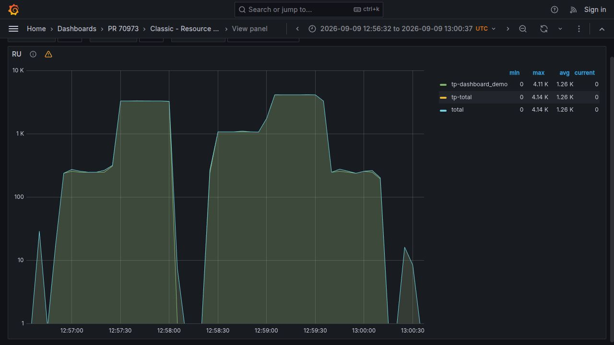
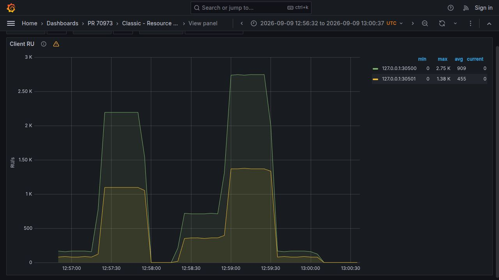
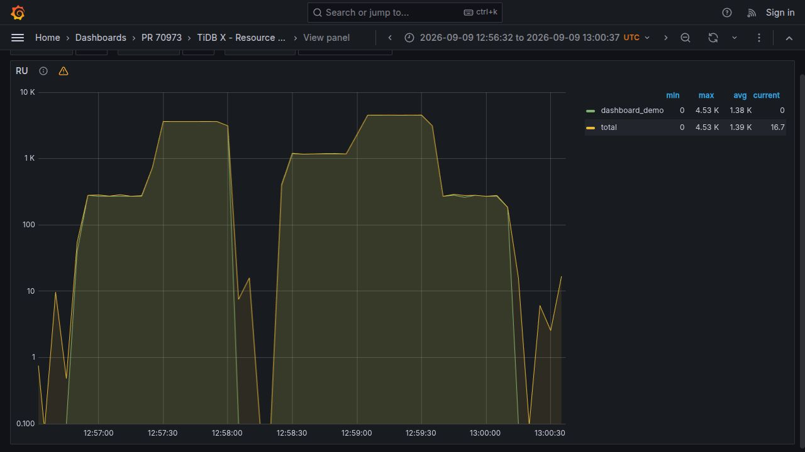
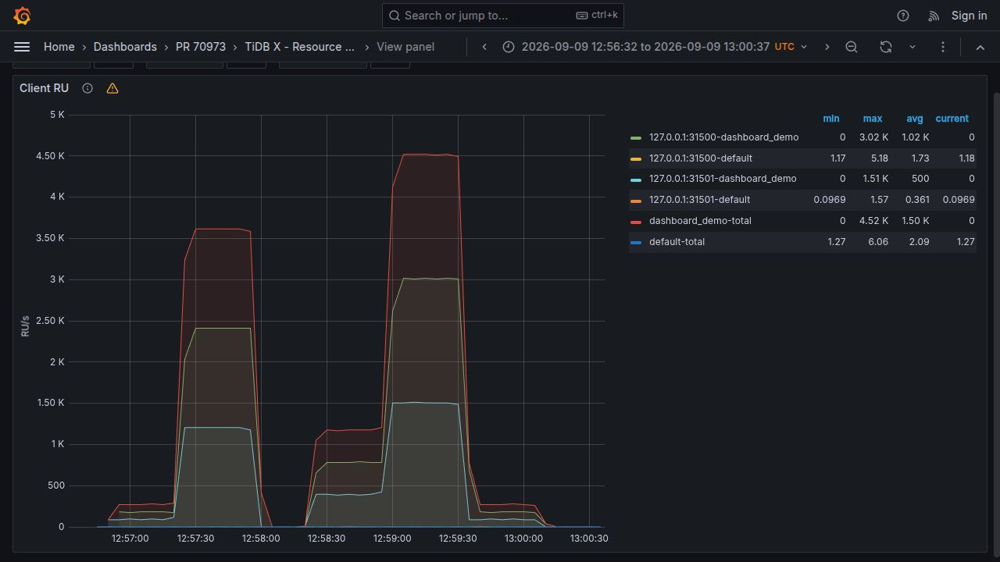
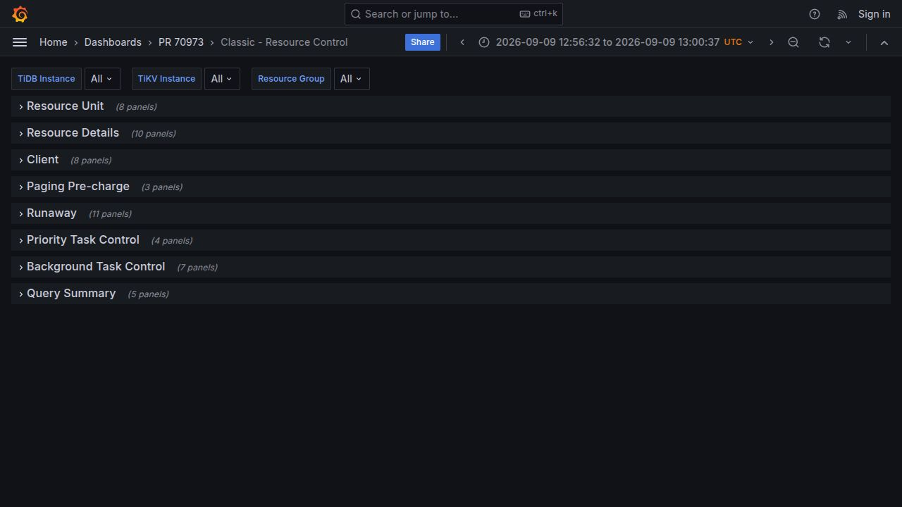
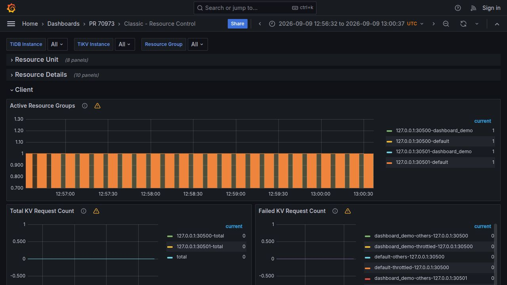
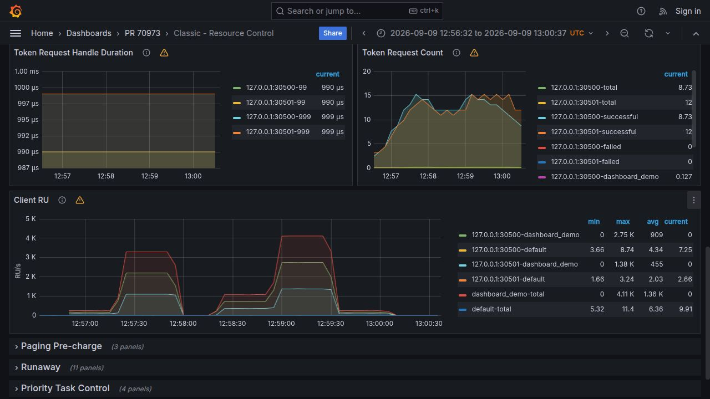
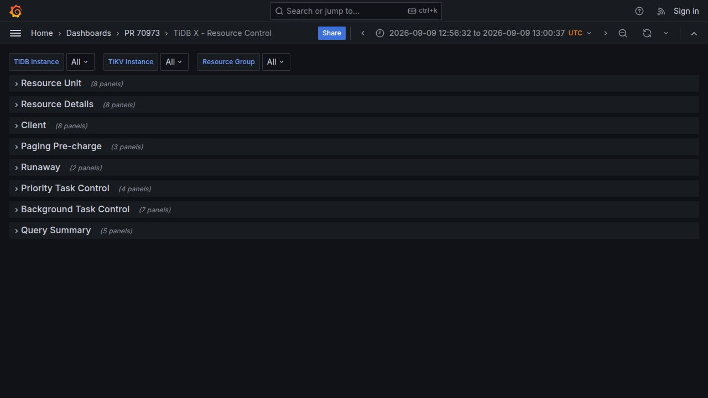
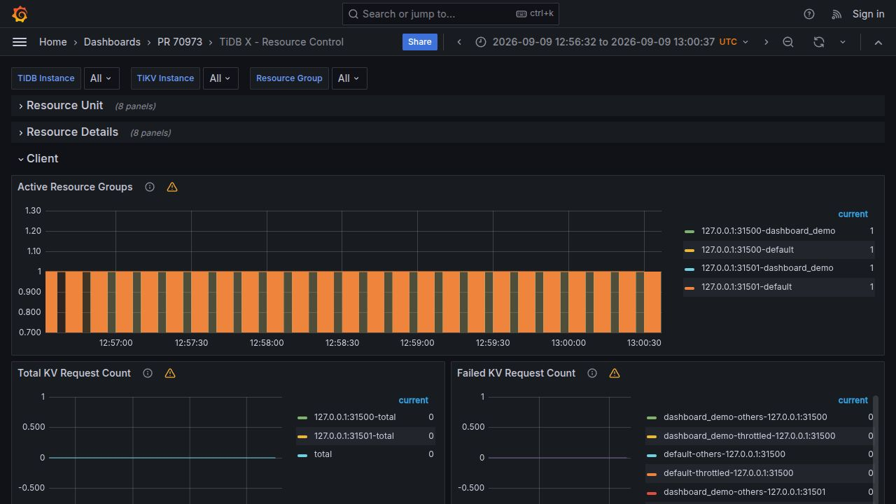
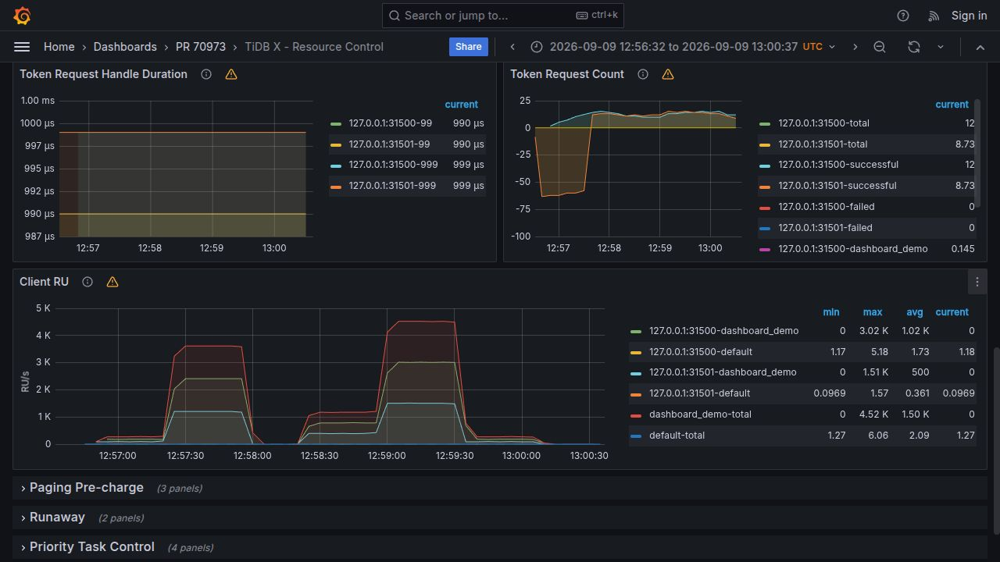

# Resource Control Grafana verification

PR: https://github.com/pingcap/tidb/pull/70973

TiDB binary revision: `4d9dfae5c361fbdf89262c6fdb81991330882bcf`. Dashboard revision: `cd1770d8f63c5f7dd1c400ab68eb096c09b05595`. The Client RU captures use the current dashboard queries against the retained real SQL workload samples; the RU queries and captures are unchanged. No new SQL workload or binary build was needed for the Resource Group aggregation change.

Both local deployments used TiDB binaries built from that revision with Go 1.26.7, using `make server` for Classic and `make server NEXT_GEN=1` for TiDB X. Classic used a Community TiKV (`39c62c85bb71e580fb34e89858b5f2e70f2f890e`) and Classic PD. TiDB X used NextGen PD, Cloud Storage Engine TiKV (`100d0dce768a69413f202fe87b1b312d04f7bf66`), MinIO, a SYSTEM TiDB, and two business TiDB instances in `keyspace1`. These are local, single-storage-node validation environments, not production topologies.

Grafana 10.4.19 and Prometheus 3.5.0 were configured with 5-second scrapes. The PR dashboards were imported with only deployment settings changed (datasource, dashboard title/UID, default variables and display timezone/time range); every target expression matches the PR JSON exactly. All eight scrape targets were healthy. The screenshots are unedited browser captures, with the graph scrolled slightly to include its time axis. Grafana's warning icon denotes the existing Graph panel's Angular deprecation, not a failed query.

The same 225-second workload ran on both architectures in resource group `dashboard_demo` (`RU_PER_SEC=100000 BURSTABLE`): each cycle updated an 8 KiB value and read it back. Four connections per instance generated requested rates of 15, 200, 0, 65, 250, 15 and 0 cycles/s on instance 1, with phase durations of 35, 35, 25, 35, 35, 35 and 25 seconds. Instance 2 used half those rates. Each architecture completed 28,628 cycles, with zero SQL errors. Recorded SQL status confirmed the PR commit on all five TiDB processes.

Both dashboards showed the two peaks and idle valleys. Client RU shows a distinct series for each instance/resource-group pair and a total per resource group across the selected instances; the instance selector was exercised in Grafana on both architectures. Queries also verified instance/resource-group filtering and nonempty, finite RU/RRU/WRU series. Client RU maxima were approximately 2,746/1,376 RU/s on Classic and 3,017/1,513 RU/s on TiDB X; each returned to zero during idle. These are observability checks, not a performance comparison between architectures.

All captures show 2026-09-09 12:56:32–13:00:37 UTC with all business TiDB instances selected. RU captures select `dashboard_demo`; Client RU captures select all resource groups and show `dashboard_demo` and `default`. For both architectures, query checks verified every group Total equals the sum of its instance details at each sampled timestamp, including resource-group and single-instance filters. Grafana interactions additionally verified that Classic single-instance totals match that instance and TiDB X resource-group selection limits both details and totals. Synthetic Prometheus tests cover two business groups, refunds, absent directions, counter resets, and filtering; all 29 query test groups passed. `make lint` and `git diff --check` also passed for the dashboard revision.

## Classic





## TiDB X





Production scrape intervals/query costs, multiple business keyspaces, and AP workloads were not tested. Refund and reset edge cases were covered by the earlier Prometheus synthetic query tests, not by this SQL workload.


## Dashboard placement and section behavior

Whole-dashboard captures use dashboard revision `2d433bfee77ec3c1fdfdfac8904e35f2f195bfa1` and the same retained workload samples. They are normal dashboard views, with no `viewPanel` parameter, at the browser's unchanged 1280×720 viewport. No image stitching or editing was used. Each architecture has three views: all collapsed sections, the expanded Client section entrance, and the end of Client with its adjacent panels and following sections.

Client is the third section after Resource Unit and Resource Details and defaults to collapsed with eight panels. Expanded order is Active Resource Groups (full width), three rows of paired half-width panels, then Client RU (full width). The row immediately above Client RU contains Token Request Handle Duration and Token Request Count; Paging Pre-charge immediately follows Client. All three pairs were checked for matching vertical positions on both architectures, and collapse/re-expand was exercised.

This whole-page test exposed a layout issue hidden by single-panel captures: every Client panel had `y=0`, so Grafana reordered the panels and separated the left/right pairs. The dashboard now assigns Client row offsets 0, 7, 14, 21 and 28. Only Client grid y coordinates changed; panel IDs, queries, and all other sections remain unchanged. `verify-layout.py` failed on `cd1770d8f6` and passed after the fix. Both Jsonnet dashboards were regenerated, `make lint` and `git diff --check` passed, and the full PR diff was reviewed.

Run the layout regression check from the TiDB source checkout at the dashboard revision:

```bash
python3 /home/coodoo/Projects/tidb-worktrees/pr70973-grafana-evidence/validation/pr70973/verify-layout.py
```

### Classic whole-dashboard views







### TiDB X whole-dashboard views







The placement fix does not change accounting or query cost. Validation covers Grafana 10.4.19 at the current desktop viewport; other Grafana versions, viewport sizes and unrelated section layouts were not retested. Prometheus and Grafana were stopped after validation; SQL clusters remained stopped throughout this follow-up.
